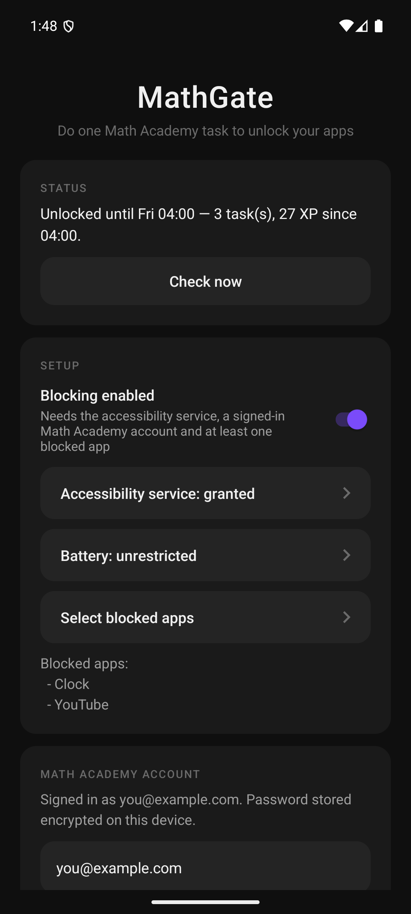
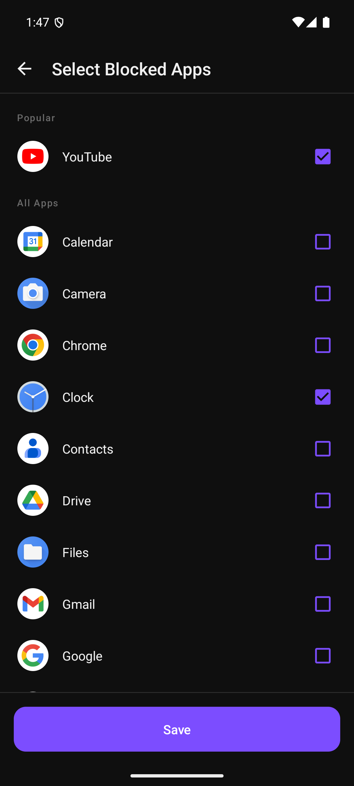
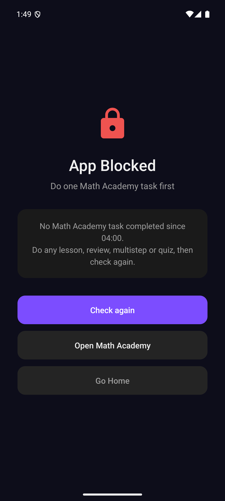

<p align="center">
  
</p>
<h1 align="center">MathGate</h1>
<p align="center"><em>MATHEMATICA REGINA SCIENTIARUM</em></p>

<p align="center">
  Block distracting apps until you have done a Math Academy task today. Pick which apps to lock — the moment you complete any lesson, review, multistep or quiz, everything unlocks until tomorrow.
</p>

<p align="center">
  <a href="https://mathgate.com"><strong>Website: mathgate.com</strong></a>
</p>

## Features

- **Any task counts** — a lesson, review, multistep or quiz all satisfy the gate
- **Configurable app blocking** — pick which apps to lock from your full app list, social media pinned to the top
- **Configurable daily reset** — defaults to 04:00, so a late night still counts as the same day
- **Fails closed** — no connection, a bad sign-in or an unexpected response all keep your apps locked
- **Quiet after the first pass** — once a task is found, the app makes no further network calls until the next reset
- **No server, no account** — MathGate talks to Math Academy directly from your phone, nothing else
- **Credentials encrypted on device** — your password is sealed with an Android Keystore key that never leaves the phone
- **No notification** — the blocker is an accessibility service, so there is no permanent status notification to live with

## How It Works

1. An `AccessibilityService` watches for window changes, so a blocked app is caught within about 100 ms of opening
2. The gate is answered from a cache, never from the network, because that check runs on the main thread
3. When the cache is cold, a background thread signs in to mathacademy.com and reads `/api/previous-tasks`
4. If any task has a `completed` timestamp at or after the current period start, the gate opens; the pass is stored and honoured until the next daily reset, even across a reboot
5. Otherwise a full-screen blocker appears explaining exactly why, with buttons to re-check or open Math Academy
6. The session cookie lasts 30 days and is refreshed automatically, so you sign in once

## Screenshots

<p align="center">
  
  &nbsp;&nbsp;
  
  &nbsp;&nbsp;
  
</p>

## Setup

1. Install the APK and open MathGate
2. **Accessibility service** — enable MathGate. If Android shows "Restricted setting", open App info, then the overflow menu, then *Allow restricted settings*
3. **Battery** — set to unrestricted, so the system does not stop the service
4. **Select blocked apps**
5. **Math Academy account** — enter your username and password, then *Sign in & test*. It reports how many tasks and how much XP you have done since the reset, and clears the password field on success
6. Turn on **Blocking enabled**

## Building

Requires JDK 17+ and the Android SDK (build-tools 36).

```bash
export JAVA_HOME=/path/to/jdk17
export ANDROID_HOME=~/Library/Android/sdk
./gradlew assembleDebug
```

The APK is output to `app/build/outputs/apk/debug/app-debug.apk`.

## Testing

Unit tests run on the JVM with no device or emulator. They cover the period arithmetic across a
British Summer Time change, the task parsing, the cookie handling, the re-login on an expired
session, the backoff after a wrong password, and the cache and single-flight behaviour of the
coordinator. `MathAcademyClientTest` drives the real HTTP client against a loopback fake of
mathacademy.com.

```bash
./gradlew testDebugUnitTest
```

End-to-end behaviour is checked on a throwaway emulator, without needing a Math Academy account:

```bash
tools/verify_on_emulator.sh
```

That script creates and boots an AVD if needed, then asserts the three cases that matter: a blocked
app is covered when nothing is done, it opens with no network call once the day's pass is cached, and
it is blocked again when that pass belongs to a previous period.

If Math Academy ever changes its login or API, `tools/ma_probe.sh` exercises both endpoints with
curl and prints status codes, cookie names and a task summary. It reads the password without echo
and never prints it.

## Installation

```bash
adb install -r app/build/outputs/apk/debug/app-debug.apk

# Optional: keep the OS from stopping the service
adb shell dumpsys deviceidle whitelist +com.mathgate

adb shell am start -n com.mathgate/.MainActivity
```

The accessibility service must be enabled from within the app or from Android settings; it cannot be
granted over adb in normal use.

## Architecture

| File | Purpose |
|------|---------|
| `MathGateAccessibilityService.kt` | Detects a blocked app coming to the foreground and launches the blocker |
| `GateStatusCoordinator.kt` | Synchronous cache plus single-flight background refresh; persists the daily pass |
| `MathAcademyClient.kt` | Form login, session cookies, `/api/previous-tasks`, automatic re-login on expiry |
| `MathAcademyGateApi.kt` | Maps client results and failures onto a `GateStatus`, all of which fail closed |
| `TaskSummariser.kt` | Counts tasks completed since the period start and sums awarded XP |
| `MaDateFormat.kt` | Builds the JavaScript-style date cursor the API expects |
| `SetCookieParser.kt` | Reads cookie values and expiry out of `Set-Cookie` headers |
| `ResetTime.kt` | Period arithmetic for the configurable daily reset |
| `SecretStore.kt` | AES-GCM encryption of the password with an Android Keystore key |
| `Prefs.kt` | SharedPreferences storage for settings, cookies and the cached pass |
| `MainActivity.kt` | Status, setup, account and reset-time screen |
| `AppSelectionActivity.kt` | App picker with icons, social media pinned to the top |
| `BlockingActivity.kt` | Full-screen blocker with the reason and a re-check button |

## Permissions

| Permission | Why |
|------------|-----|
| `BIND_ACCESSIBILITY_SERVICE` | Detect which app has come to the foreground so it can be blocked |
| `INTERNET` | Sign in to mathacademy.com and read your completed tasks |
| `REQUEST_IGNORE_BATTERY_OPTIMIZATIONS` | Ask to be exempted so the OS does not stop the service |

MathGate requests no usage-access, overlay, notification or boot permission.

## Privacy

MathGate has no backend. Your Math Academy username, password and session cookies are stored in the
app's private storage, with the password encrypted using a key held in the Android Keystore. The only
network destination is `www.mathacademy.com`. Nothing is sent anywhere else, there is no analytics,
and uninstalling the app deletes everything it stored.

## Requirements

- Android 8.0+ (API 26)
- A [Math Academy](https://mathacademy.com) account

## License

All Rights Reserved. MathGate is proprietary software. You may not copy, modify, or distribute this
software without explicit permission from the author.
